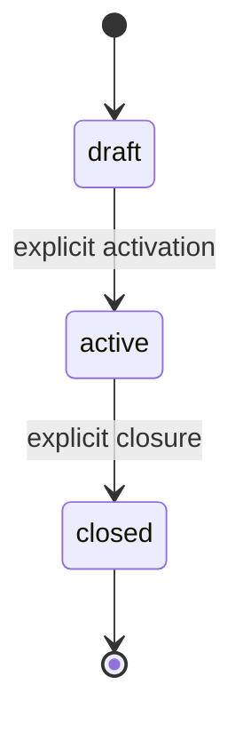
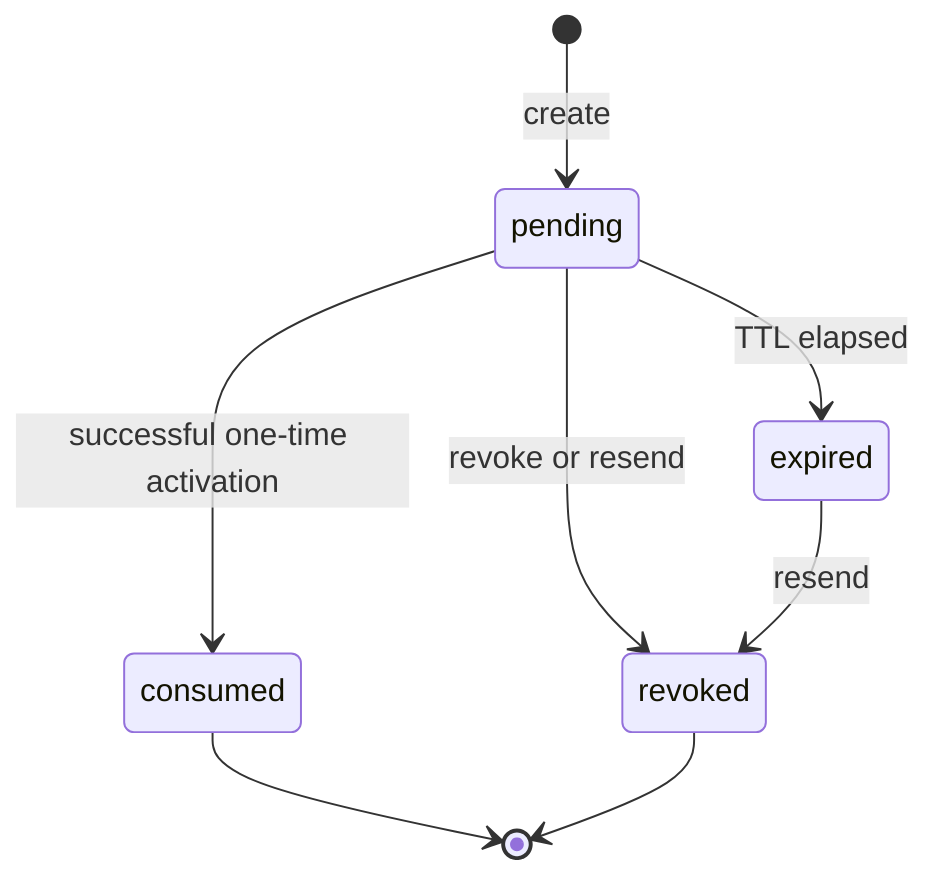
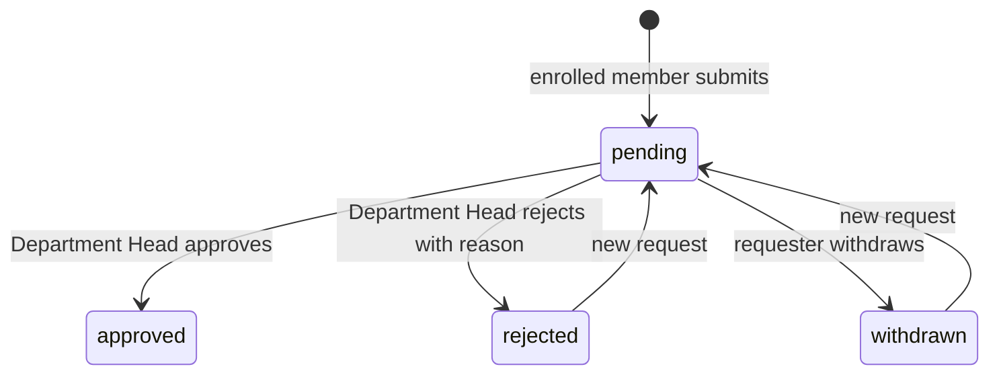

# Decision 0003: Authentication and Authorization Architecture Baseline

Status: accepted for Phase 0

Date: 2026-09-18

Roadmap: `docs/AUTHORIZATION_ROADMAP.md`

## Decision

TMG Church will replace the global `leaders` authorization model with live, database-backed capability checks derived from system roles and Ministry Term, Department, and Group assignments. Supabase Auth remains responsible for identity, passwords, and sessions; PostgreSQL Row Level Security remains the authoritative application authorization boundary.

This decision defines the Phase 0 architecture baseline. It intentionally leaves exact table, enum, function, policy, hook, and UI implementation details to the roadmap phase that owns them.

## Non-goals

- This document is not an implementation plan or migration script.
- It does not authorize application, database, Supabase, email, or deployment changes.
- It does not define the final Phase 9 member portal beyond the access needed for Department requests.
- It does not replace the phase-specific brainstorm and active brief required by the roadmap.

## 1. Domain model

### Existing records retained

The design builds on the existing domain hierarchy and membership records:

- `auth.users` owns authenticated identity.
- `member_profile` is the Church member record and may link to at most one Auth user.
- `ministry_term` contains `term_department` and `term_group` records.
- `ministry_membership` enrolls a member in a Ministry Term.
- `ministry_assignment` and `term_group_membership` represent Department and Group participation.
- `ministry_session`, `session_participant`, and `attendance_record` remain the session and attendance records.

### New authorization concepts

| Concept                 | Scope                                        | Purpose                                                               | Durable rule                                                                                                   |
| ----------------------- | -------------------------------------------- | --------------------------------------------------------------------- | -------------------------------------------------------------------------------------------------------------- |
| System role assignment  | Church                                       | Holds `master_admin` or `admin`                                       | Stable state has exactly one `master_admin`; only that role manages `admin` assignments                        |
| Term role assignment    | Ministry Term                                | Holds the Ministry Head, Secretary, Treasurer, and commissioner seats | One holder per seat per term; draft assignments are dormant; closed-term assignments grant no write capability |
| Derived Department Head | Matching Department in a term                | Gives a commissioner Department-head authority                        | Derived from the commissioner assignment; never stored as a second role assignment                             |
| Account invitation      | Existing member profile and normalized email | Allows invitation-only password account activation                    | Fifteen-minute TTL, one-time use, hashed token at rest, resend revokes older unconsumed invitations            |
| Department join request | Member, term, and Department                 | Tracks member-requested Department enrollment                         | Requester must be enrolled in the term; decisions and membership creation are atomic                           |
| Application audit event | Church and affected scope                    | Records security-sensitive business actions                           | Append-only; records actor, action, target, scope, time, and minimal safe context                              |

### Identity and assignment invariants

- A normalized account email is unique across member profiles.
- An invitation targets only the email attached to its member profile.
- Email changes require verification before the account-to-member link adopts the new address.
- System roles attach to Auth identities; operational term roles attach to member profiles so a future assignment can exist before account activation.
- A member must be enrolled in the Ministry Term before receiving term, Department, or Group participation.
- A person may hold multiple compatible roles across terms and scopes.
- Secretary and Treasurer are assignable and visible but receive no feature capability in this initiative.
- Fixed Department and role codes change only through reviewed migrations and matching capability updates.
- The exact database mechanism that protects the single `master_admin`, including bootstrap and break-glass recovery, is decided and tested in Phase 1.

## 2. Role x capability x scope baseline

The table records the agreed business authority for an active term. A dash means denied by default. Church-wide system roles remain subject to the draft and closed lifecycle overrides in Section 3.

| Capability                                          | `master_admin` | `admin` | Ministry Head | Small Groups Commissioner           | Matching Department Head  | Group Leader / Deputy | Bible Study Leader | Enrolled member       |
| --------------------------------------------------- | -------------- | ------- | ------------- | ----------------------------------- | ------------------------- | --------------------- | ------------------ | --------------------- |
| Manage `admin` assignments                          | Church         | -       | -             | -                                   | -                         | -                     | -                  | -                     |
| Invite, resend, or revoke accounts                  | Church         | Church  | -             | -                                   | -                         | -                     | -                  | -                     |
| Assign or revoke Ministry officers                  | Church         | Church  | -             | -                                   | -                         | -                     | -                  | -                     |
| Prepare draft term structure and future assignments | Church         | Church  | -             | -                                   | -                         | -                     | -                  | -                     |
| Activate or close a term                            | Church         | Church  | -             | -                                   | -                         | -                     | -                  | -                     |
| Enroll or unenroll term members                     | Church         | Church  | Own term      | -                                   | -                         | -                     | -                  | -                     |
| Assign or unassign Department members               | Church         | Church  | Own term      | Own Department                      | Own Department            | -                     | -                  | -                     |
| Decide Department join requests                     | -              | -       | -             | Own Department                      | Own Department            | -                     | -                  | -                     |
| Submit or withdraw own Department request           | -              | -       | -             | -                                   | -                         | -                     | -                  | Self in enrolled term |
| Assign or unassign Group members                    | Church         | Church  | Own term      | All Groups in own term              | -                         | Own Group             | -                  | -                     |
| Assign or revoke Group leadership                   | Church         | Church  | Own term      | -                                   | -                         | -                     | -                  | -                     |
| Manage Department sessions and attendance           | Church         | Church  | Own term      | Own Department                      | Own Department            | -                     | -                  | -                     |
| Manage Group sessions and attendance                | Church         | Church  | Own term      | -                                   | -                         | Own Group             | Own Group          | -                     |
| Read member phone numbers                           | Church         | Church  | Own term      | All Groups in term + own Department | Members of own Department | Members of own Group  | -                  | Self only             |

Additional rules:

- Ministry Head authority is operational within the assigned active term and never includes Ministry officer appointment or removal.
- Every commissioner, including the Small Groups Commissioner, derives Department-head authority for the matching Department.
- The Small Groups Commissioner's additional cross-Group authority covers Group membership only; it does not include Group leadership or Group session management.
- Department-request decisions belong to the matching Department Head. System administrators and the Ministry Head may manage Department membership directly but do not impersonate the request approver.
- Session authority belongs to the current authorized role in the resource scope, not to the session creator.
- Capabilities compose by union without crossing scope boundaries.
- An authenticated account with no effective role receives no administration capability.

## 3. Lifecycle state machines

### Ministry Term

| State    | Allowed writes                                                                                                                                           |
| -------- | -------------------------------------------------------------------------------------------------------------------------------------------------------- |
| `draft`  | System administrators may prepare structure and future role assignments only. Operational membership, requests, sessions, and attendance remain blocked. |
| `active` | The capability matrix is effective. At most one term per Ministry may be active.                                                                         |
| `closed` | Historical reads only. Every application role, including system administrators, is denied writes. The application provides no reopen transition.         |

Lifecycle status, not dates, is the authorization source of truth. Activation and closure are audited.

### Account invitation

- Resend revokes every older unconsumed invitation before issuing a replacement.
- Expiry may be evaluated dynamically; it does not need a scheduled state update.
- Consumption must serialize concurrent attempts so only one can succeed.

### Department join request

- Approval atomically creates exactly one valid Department assignment.
- Rejection retains a reason.
- Reapplication creates a new request and preserves history.
- Closed or draft terms reject request mutations.

## 4. Authorization and RLS enforcement model

### Enforcement order

1. Resolve the authenticated Auth user and linked active member profile.
2. Resolve the target resource and its Church, Ministry Term, Department, or Group scope.
3. Apply term lifecycle overrides before evaluating role grants.
4. Resolve live system, term, derived Department, and Group authority from database records.
5. Allow only a capability that covers the exact target scope; otherwise deny.

### Enforcement layers

| Layer                                      | Responsibility                                                                               |
| ------------------------------------------ | -------------------------------------------------------------------------------------------- |
| UI                                         | Presents only relevant navigation and actions; never acts as a security boundary             |
| Server Components and Server Actions       | Require a session, validate input with Zod, resolve scope, and return structured safe errors |
| PostgreSQL RLS and transactional functions | Authoritative read and write enforcement, including direct Data API and RPC access           |
| Constraints and triggers                   | Protect durable scope, lifecycle, uniqueness, and atomic workflow invariants                 |
| Audit                                      | Records accepted security-sensitive mutations without secrets or unnecessary PII             |

### Security properties

- Authorization is deny-by-default.
- Operational authority is resolved from live database state rather than long-lived JWT role claims, so revocation takes effect without waiting for token refresh.
- Every affected table, view, RPC, and Server Action must appear in the Phase 2 authorization inventory before cutover.
- RPCs cannot rely on caller-side filtering; each validates capability and resource scope internally or is protected by equivalent RLS.
- Public pages use approved public projections that exclude phone numbers, Auth IDs, archived members, care data, and private notes.
- Private fields are returned only through scoped reads that apply the same capability model.
- `SECURITY DEFINER` helpers, if used, must have a fixed safe `search_path`, minimal grants, and tests for privilege escalation.
- The application does not use a service-role key.
- Exact capability identifiers, resolver signatures, RLS expressions, and policy rollout order remain Phase 2 decisions.

## 5. Invitation activation sequence

1. A system administrator selects an existing, non-archived member profile with a unique normalized email.
2. The application creates a high-entropy token, persists only its secure hash and expiry, records an audit event, and sends the raw token only in the invitation message.
3. The acceptance page validates the invitation without exposing private member data and lets the invited person choose a password.
4. Supabase Auth performs email/password account creation. A Before User Created Hook rejects signup without valid invitation proof.
5. Invitation validation checks the intended email, pending state, 15-minute TTL, and one-time-use state under concurrency control.
6. Successful activation consumes the invitation and links the new Auth user to the intended member profile without allowing a second account or a half-linked successful state.
7. The raw token is excluded from database rows, Auth metadata at rest, logs, analytics, audit payloads, and error messages.
8. The resulting account signs in with email/password. An account with no effective operational role reaches the no-access state during the leadership pilot.

The exact activation-proof transport and transaction boundary between Supabase Auth and application data require an official-documentation check and local prototype in Phase 4. They must satisfy the properties above; this ADR does not prescribe passing the raw token through persisted Auth metadata.

Supabase SMTP and templates handle Auth-generated messages such as recovery and verified email changes. The custom invitation uses a separate application mail path, which may use the same provider. Provider selection and production credentials remain Phase 4 user-owned decisions.

## 6. Migration and rollback strategy

### Phase 1: additive foundation

- Inspect current data for duplicate or invalid emails and identify the exact bootstrap Auth user before migration authoring.
- Add the minimum system-role, term-role, lifecycle, and business-audit foundation approved by the Phase 1 brief.
- Bootstrap the single `master_admin` without removing or weakening `leaders` or `is_leader()`.
- Keep current application behavior available while new assignments have no production authorization effect.
- Verify local reset/apply, invariant failures, generated types, and the bootstrap recovery procedure.
- Prefer an additive rollback or forward recovery. Do not use broad `CASCADE` teardown against data-bearing production objects.

### Phase 2: capability and RLS cutover

- Inventory every existing `is_leader()` call, RLS policy, RPC, query, and mutation before changing enforcement.
- Introduce capability checks behind a compatibility period so the bootstrap account remains recoverable.
- Cut over in reviewable groups with positive and negative persona tests.
- Retire `leaders` only after direct Data API, RPC, server, and real-account verification proves the replacement boundary.
- Prepare an exact, tested lockout-recovery path before any linked change. A failed cutover restores the last verified authorization boundary without discarding new role data.

### Phase 4: invitation and hosted Auth configuration

- Deploy invitation storage and application behavior separately from enabling the hosted Auth Hook and production mail settings.
- Keep public signup closed throughout rollout and rollback.
- Stage the hook, SMTP, templates, redirect URLs, rate limits, and invitation mailer with a real test inbox before leadership invitations.
- A rollback pauses new invitations and restores the last verified signup gate without disabling existing password sign-in accounts.

### Production control

- Read-only linked migration inspection is allowed during preflight.
- Linked migrations, hosted Supabase changes, secrets, real invitations, push, and deployment require explicit authorization in the active brief.
- Every production action has a named operator, preflight evidence, success check, and recovery command or dashboard procedure before execution.

## 7. Cross-phase test-persona matrix

### Required fixtures

Test data includes separate draft, active, and closed terms; at least two Departments; at least two Groups; members who share and do not share scopes; and accounts with compatible multi-role combinations.

| Persona                                      | Positive baseline                                                                                                               | Required negative baseline                                                                                       |
| -------------------------------------------- | ------------------------------------------------------------------------------------------------------------------------------- | ---------------------------------------------------------------------------------------------------------------- |
| `master_admin`                               | Manages admins and all active-term business operations                                                                          | Cannot create a second master or mutate operational data in draft/closed terms                                   |
| `admin`                                      | Manages invitations, operational roles, and active-term business operations Church-wide                                         | Cannot manage system-role hierarchy or mutate operational data in draft/closed terms                             |
| Ministry Head                                | Operates across the assigned active term and reads term member phones                                                           | Cannot appoint Ministry officers, operate in another term, or write after closure                                |
| Small Groups Commissioner                    | Exercises matching Department-head authority; also assigns Group members and reads Group phones across the assigned active term | Cannot change Group leadership, manage Group sessions, operate in another Department, or operate in another term |
| Each other commissioner                      | Exercises Department-head capabilities in the matching Department                                                               | Cannot operate in another Department or gain unrelated commissioner authority                                    |
| Group Leader                                 | Manages members, sessions, attendance, and phone reads in the assigned Group                                                    | Cannot operate in another Group or change Group leadership                                                       |
| Deputy Leader                                | Has the same approved Group membership, session, and phone authority as Group Leader                                            | Cannot operate in another Group or change Group leadership                                                       |
| Bible Study Leader                           | Manages sessions and attendance in the assigned Group                                                                           | Cannot manage Group membership or read member phone numbers through this role                                    |
| Secretary or Treasurer                       | Is assignable and visible                                                                                                       | Receives no operational capability from that role                                                                |
| Enrolled member                              | Submits and withdraws own Department request in an active term                                                                  | Cannot request for another member or use administration capabilities                                             |
| Authenticated account with no effective role | Keeps a valid account and reaches the no-access state during the pilot                                                          | Cannot access administration reads or mutations                                                                  |
| Anonymous user                               | Reads only approved public projections                                                                                          | Cannot access private fields or authenticated operations                                                         |

### Verification vectors

Each applicable allow and deny case is exercised through:

- route and navigation behavior;
- direct URL and Server Component reads;
- Server Action mutations with valid and tampered input;
- RPC execution;
- direct Data API access under RLS;
- lifecycle transitions and immediate role revocation;
- audit creation and sensitive-data redaction.

Phase 1 proves schema invariants and bootstrap recovery. Phase 2 proves capability and RLS isolation. Phases 3-7 add workflow-specific cases. Phase 8 repeats the complete matrix with real pilot accounts before broader member access.

## Deferred implementation decisions

- Phase 1: exact tables, columns, enum or check-constraint representation, indexes, triggers, audit payload shape, and master-admin recovery mechanism.
- Phase 2: exact capability catalog, resolver interfaces, per-table RLS expressions, RPC guards, private projections, and cutover batches.
- Phase 3: administration navigation and role editor interactions.
- Phase 4: password policy, rate limits, activation-proof transport, Auth Hook transaction design, mail provider, templates, and operational runbook.
- Phases 5-7: exact UI affordances and existing workflow integration points.
- Phase 8: pilot roster, production-like fixtures, and severity thresholds below the already-fixed critical/high gate.
- Phase 9: member portal scope and rollout cohort.

## Consequences

- Authorization becomes scoped and revocable without coupling operational roles to Auth credentials.
- RLS, server guards, and UI share one capability vocabulary while retaining distinct enforcement responsibilities.
- Delivery requires an additive foundation and a separately verified cutover; login rollout cannot safely precede authorization foundations.
- The design adds planning and test work up front, but reduces lockout risk, privilege drift, and duplicated role data.
